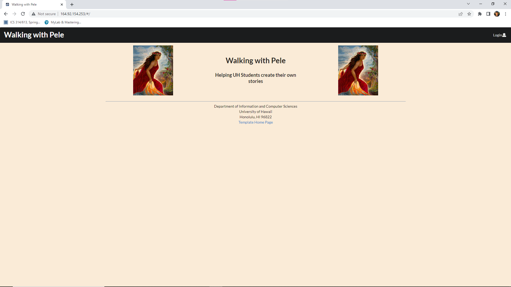
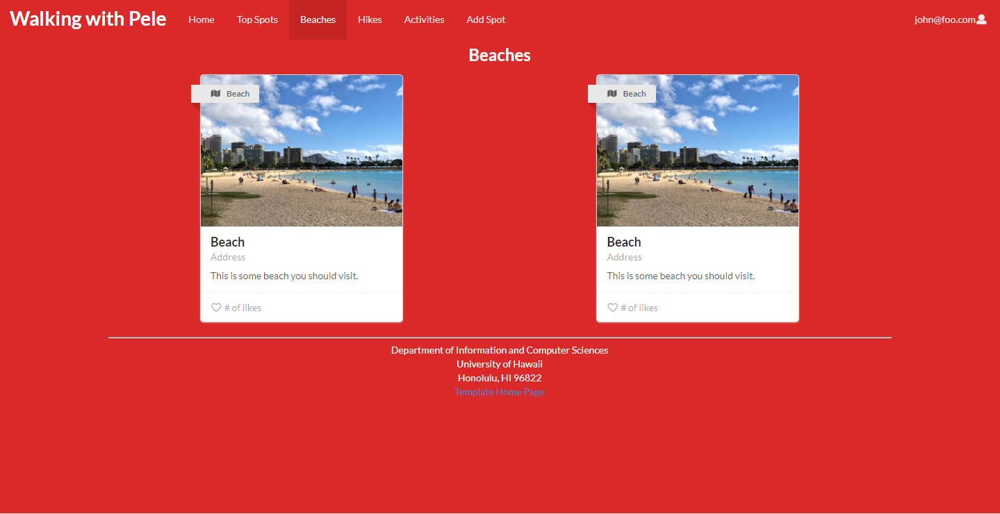
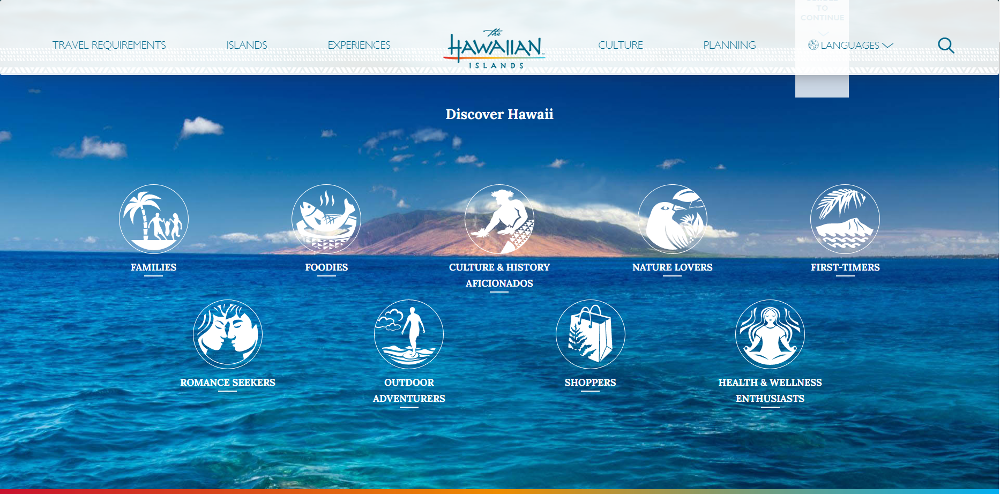

## Overview

*Walking with Pele* is a web application that will provide a portal for students in search of adventure. Oahu contains a multitude of experiences for individuals to encounter. This web application will enable students to find new experiences on Oahu while also sharing their own for others to see. By doing so, the application will build upon itself in a way that it will provide new paths for new students to follow.

## User Guide (with Page Mockups and Sample Pages)

This section showcases the application's user interface along with its capabilities.

### Landing Page

This page greets the user.

### Index Pages (Top Spots, Beaches, Hikes, Activities)

This application provides a few pages that present its database.

The "Top Spots" page shows the "Spots" or locations that have the highest likes based on User review. The "Beaches" page shows the defined beaches. The "Hikes" page shows the defined hikes. The "Activities" page shows the defined activities:

### Sign in and Sign up

By clicking on the "Login" button, users have the option to either "Sign in" or "Sign up". If the user already has an account, they may choose "Sign in" and will be brought to the following page to do so:

If the user does not have an account, they may choose "Sign up" to register their own account and will be brought to the following page accordingly:

### Home Page

After the user has logged in, they are taken to the home page, which is quite similar to that of the "Landing" page with the inclusion of the NavBar.

### User Page

This page contains basic information about a user such as their Name, along with the "Spots" they have visited and reviewed.

### Spot Page

This page contains basic information about a "Spot" such as the location name, address, reviews, and activities associated with it.

### Add Spot Page

Logged-in users are also given the ability to create and define "Spots" to share with other users.

## Team

*Walking with Pele* is designed, implemented, and maintained by the combined efforts of Hyuma Tsuchiya, Don Maddock, Kai He, Zhixin Li, and Joshua Rico.

- [Team Contract](https://docs.google.com/document/d/14qmEBdDGsJFoggl1_zcuq7dORanDT3HtZ3sc19qAK7Y/edit?usp=sharing)
- [GitHub Organization](https://github.com/walking-with-pele)
- [M1 Project Page](https://github.com/orgs/walking-with-pele/projects/1)
