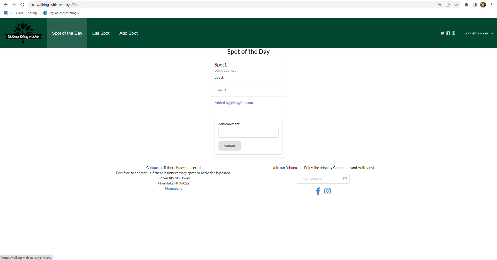
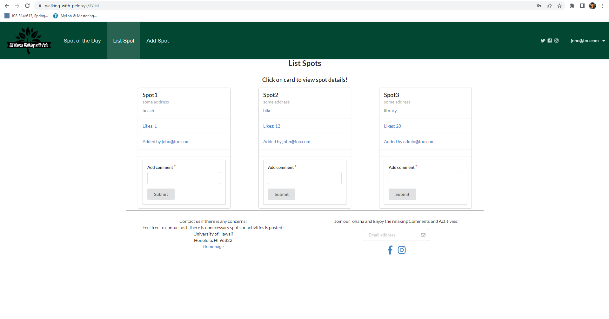
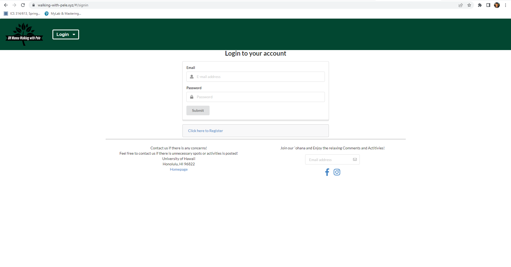
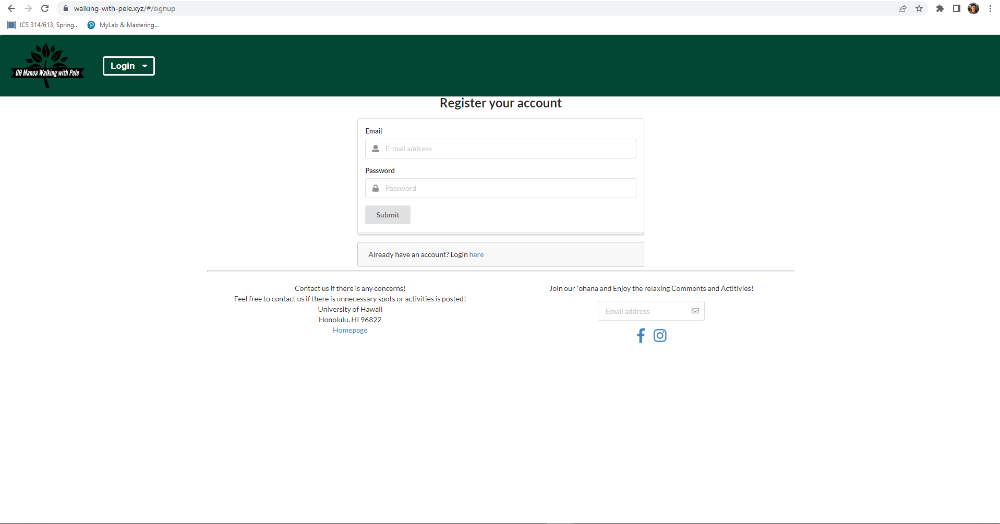
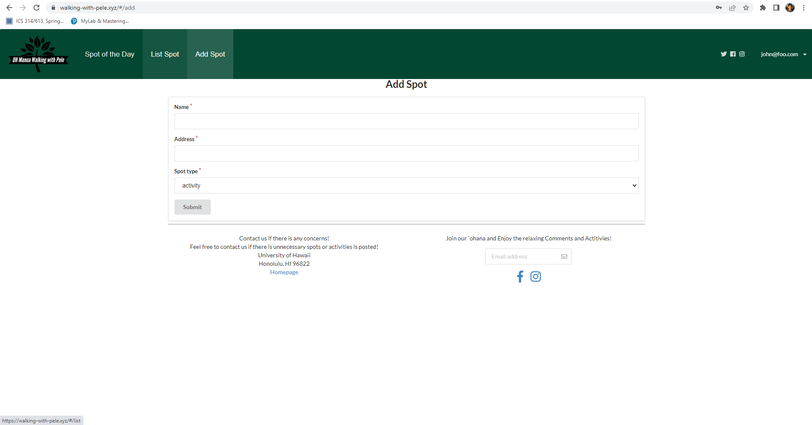
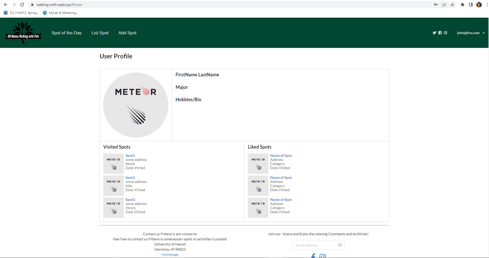
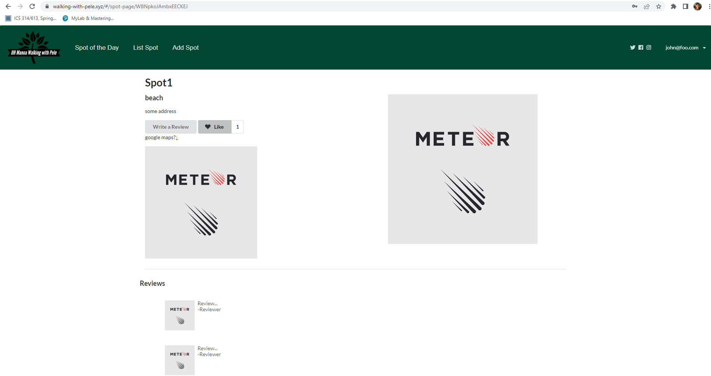

## Table of Contents
* [Overview](#overview)
* [User Guide](#user-guide-with-page-mockups-and-sample-pages)
    * [Index Pages](#index-pages-spot-of-the-day-list-spots)
    * [Sign Up / Sign In Pages](#sign-in-and-sign-up)
    * [Home Page](#home-page)
    * [Add Spot Page](#add-spot-page)
    * [User Page](#user-page)
    * [Spot Page](#spot-page)
* [Developer Guide](#developer-guide)
  * [Installation](#installation)
* [Team](#team)
    * [Team Contract](#team)
    * [GitHub Organization](#team)
    * [M1 Project Page](#team)
    * [M2 Project Page](#team)
    * [M3 Project Page](#team)
    * [Deployment](#team)


## Overview

*Walking with Pele* is a web application that will provide a portal for students in search of adventure. Oahu contains a multitude of experiences for individuals to encounter. This web application will enable students to find new experiences on Oahu while also sharing their own for others to see. By doing so, the application will build upon itself in a way that it will provide new paths for new students to follow.


## User Guide (with Page Mockups and Sample Pages)

This section showcases the application's user interface along with its capabilities.

### Landing Page

This page greets the user.


### Index Pages (Spot of the Day, List Spots)

This application provides a few pages that present its database.

The "Spot of the Day" page recommends a "Spot" for users to check-out. This page also allows Users to hold conversations with others in regard to the Spot:



The "List Spots" page allows users to see all the Spots added to the application and all of their information. There will also be a search function implemented that will allow users to filter through Spots given certain requirements.



### Sign in and Sign up

By clicking on the "Login" button, users have the option to either "Sign in" or "Sign up". If the user already has an account, they may choose "Sign in" and will be brought to the following page to do so:



If the user does not have an account, they may choose "Sign up" to register their own account and will be brought to the following page accordingly:



### Home Page

After the user has logged in, they are taken to the home page, which is quite similar to that of the "Landing" page with the inclusion of the NavBar.


### Add Spot Page

Logged-in users are also given the ability to create and define "Spots" to share with other users.



### User Page

This page contains basic information about a user such as their Name, along with the "Spots" they have visited and reviewed.



### Spot Page

This page contains basic information about a "Spot" such as the location name, address, reviews, and activities associated with it.



## Developer Guide

This section provides information about how to use our code for their own projects.

### Installation

The first step would be to [install Meteor](https://www.meteor.com/install).

Following the installation, visit our [application GitHub page](https://github.com/walking-with-pele/walking-with-pele). While there, select the option to "Use this template" to create a GitHub repository initialized with your own copy of the application. Then, clone the repository to your computer locally.

Assuming everything was successful, change directory to the walking-with-pele/app directory and install the required libraries with the following command:
```
$ meteor npm install
```

Right after installing the libraries, start the application with the following command:
```
$ meteor npm run start
```

The application should appear at [https://localhost:3000](https://localhost:3000).

## Team

*Walking with Pele* is designed, implemented, and maintained by the combined efforts of Hyuma Tsuchiya, Don Maddock, Kai He, Zhixin Li, and Joshua Rico.

- [Team Contract](https://docs.google.com/document/d/14qmEBdDGsJFoggl1_zcuq7dORanDT3HtZ3sc19qAK7Y/edit?usp=sharing)
- [GitHub Organization](https://github.com/walking-with-pele)
- [M1 Project Page](https://github.com/orgs/walking-with-pele/projects/1)
- [M2 Project Page](https://github.com/orgs/walking-with-pele/projects/2)
- [M3 Project Page](http://github.com/orgs/walking-with-pele/projects/3)
- [Deployment](https://walking-with-pele.xyz/)
